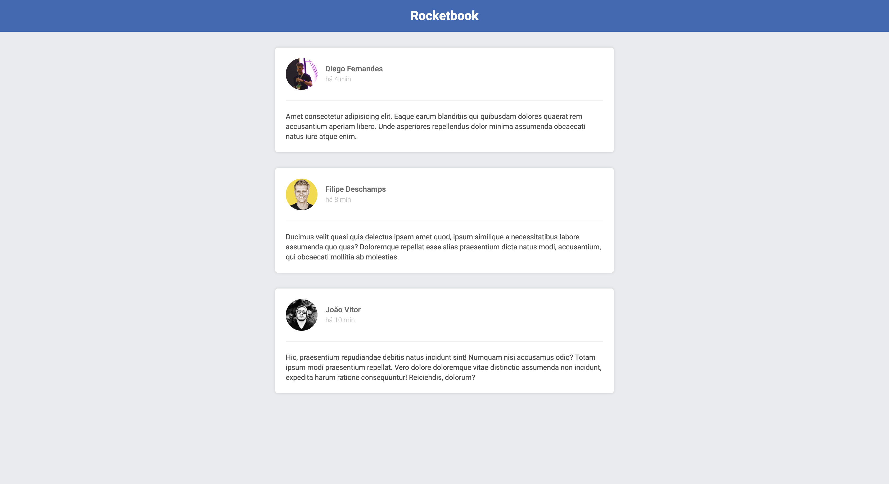

# Rocketbook

A simple UI developed with ReactJS from scratch.

## How to run

### Prerequisites

You need [Node.js](https://nodejs.org/) to run it.

### Installing

- Run `npm install`
- Run `npm start`
- Access http://localhost:8080/ in your browser

## License

This project is licensed under the MIT License - see the [LICENSE.md](LICENSE.md) file for details.
